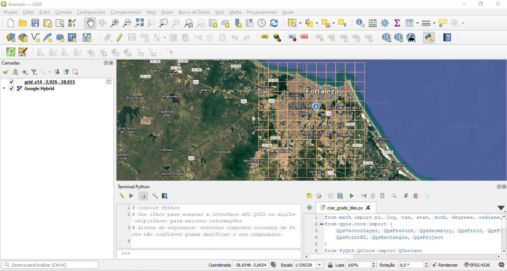

# Tutorial: Usando Python no QGIS para criar grades de tiles

Este repositório contém um tutorial que demonstra como utilizar Python dentro do QGIS para criar uma grade de tiles a partir de coordenadas geográficas e um nível de zoom. O tutorial inclui um script Python que automatiza a criação dessa grade e exibe o resultado no QGIS.

## Introdução

Tiles são pequenos blocos quadrados que dividem mapas digitais em seções, normalmente de 256x256 pixels, que permitem a visualização eficiente de grandes áreas geográficas em aplicações web e desktop. Cada tile corresponde a uma coordenada específica e um nível de zoom, permitindo que apenas a parte do mapa que está sendo visualizada seja carregada, melhorando a performance e a experiência do usuário. São utilizados por provedores de mapas, como *Google Maps*, *Bing Maps* e *OpenStreetMap*, que disponibilizam mapas baseados em camadas de tiles pré-gerados ou dinâmicos.

O entendimento e a manipulação de tiles pode ser útil para o geoprocessamento, a visualização de mapas interativos e a integração de dados geoespaciais, permitindo controlar a resolução, área de cobertura e atributos das camadas do mapa. Este tutorial mostra como gerar tiles customizados usando Python no QGIS, de forma automatizada.

## Pré-requisitos

Antes de começar, certifique-se de ter instalado:

- [QGIS](https://qgis.org) (versão 3.x ou superior)
- Python 3.x (integrado ao QGIS)

## Passo a Passo

### 1. Abrir o Python Console no QGIS

1. Abra o QGIS.
2. Vá em `Complementos > Terminal Python` para abrir o console Python integrado.

### 2. Salvar e Carregar o Script Python

1. Clique em `Mostrar editor` para exibir o editor de scripts em Python
2. Crie um arquivo chamado `criar_grade_tiles.py` e cole o seguinte código:

```python
from math import pi, log, tan, atan, sinh, degrees, radians, cos
from qgis.core import (
    QgsVectorLayer, QgsFeature, QgsGeometry, QgsField, QgsFields,
    QgsPointXY, QgsRectangle, QgsProject
)
from PyQt5.QtCore import QVariant

def criar_grade_tiles(zoom, min_lon, min_lat, max_lon, max_lat):
    """
    Cria uma grade de tiles no QGIS baseada em coordenadas geográficas e nível de zoom.

    Parâmetros:
    - zoom (int): Nível de zoom da grade.
    - min_lon, min_lat (float): Coordenadas mínimas (longitude e latitude) da área.
    - max_lon, max_lat (float): Coordenadas máximas (longitude e latitude) da área.

    O script cria uma camada de memória no QGIS com polígonos representando cada tile
    e adiciona atributos X, Y, Zoom e os limites geográficos de cada tile.
    """

    if min_lat > max_lat or min_lon > max_lon:
        raise ValueError("As coordenadas mínimas devem ser menores que as máximas.")

    def latlon_to_tile_coords(lat, lon, zoom):
        n = 2.0 ** zoom
        xtile = int((lon + 180.0) / 360.0 * n)
        ytile = int((1.0 - log(tan(radians(lat)) + 1 / cos(radians(lat))) / pi) / 2.0 * n)
        return xtile, ytile

    def tile_coords_to_bounds(x, y, zoom):
        n = 2.0 ** zoom
        lon1 = x / n * 360.0 - 180.0
        lat1 = degrees(atan(sinh(pi * (1 - 2 * y / n))))
        lon2 = (x + 1) / n * 360.0 - 180.0
        lat2 = degrees(atan(sinh(pi * (1 - 2 * (y + 1) / n))))
        return lon1, lat2, lon2, lat1

    x_min, y_max = latlon_to_tile_coords(min_lat, min_lon, zoom)
    x_max, y_min = latlon_to_tile_coords(max_lat, max_lon, zoom)

    fields = QgsFields()
    fields.append(QgsField("x", QVariant.Int))
    fields.append(QgsField("y", QVariant.Int))
    fields.append(QgsField("zoom", QVariant.Int))
    fields.append(QgsField("lon_min", QVariant.Double))
    fields.append(QgsField("lat_min", QVariant.Double))
    fields.append(QgsField("lon_max", QVariant.Double))
    fields.append(QgsField("lat_max", QVariant.Double))

    layer_name = f"grid_z{zoom}_{min_lat:.3f}_{min_lon:.3f}"
    layer = QgsVectorLayer("Polygon?crs=EPSG:4326", layer_name, "memory")
    provider = layer.dataProvider()
    provider.addAttributes(fields)
    layer.updateFields()

    for x in range(x_min, x_max + 1):
        for y in range(y_min, y_max + 1):
            lon1, lat1, lon2, lat2 = tile_coords_to_bounds(x, y, zoom)
            rect = QgsRectangle(lon1, lat1, lon2, lat2)
            geom = QgsGeometry.fromPolygonXY([[
                QgsPointXY(rect.xMinimum(), rect.yMinimum()),
                QgsPointXY(rect.xMaximum(), rect.yMinimum()),
                QgsPointXY(rect.xMaximum(), rect.yMaximum()),
                QgsPointXY(rect.xMinimum(), rect.yMaximum()),
                QgsPointXY(rect.xMinimum(), rect.yMinimum())
            ]])
            feat = QgsFeature()
            feat.setGeometry(geom)
            feat.setAttributes([x, y, zoom, lon1, lat1, lon2, lat2])
            provider.addFeature(feat)

    layer.updateExtents()
    QgsProject.instance().addMapLayer(layer)
    print(f"Grade criada: {layer_name}")
```

### 3. Executar o Script no QGIS

1. No editor de scripts, clique em `Executar script` para carregar o script.
2. No terminal Python execute a função com os parâmetros desejados.

## Exemplo de aplicação

A execução da seguinte chamada da função no terminal Python criará a grade de tiles no zoom 14 cobrindo a região de Fortaleza, Ceará. O resultado dessa execução é mostrado abaixo.

```Python
criar_grade_tiles(zoom=14, min_lon=-38.65512, min_lat=-3.92597, max_lon=-38.43527, max_lat=-3.66803)
```



## Conclusão

Este tutorial mostrou como utilizar o Python no QGIS para automação e criar grades de tiles georreferenciadas. As grade são adicionadas como camadas de memória no QGIS com atributos personalizados. Essa funcionalidade pode ser útil para criar grades maiores, exportar para shapefiles ou integrar com mapas base do QGIS.